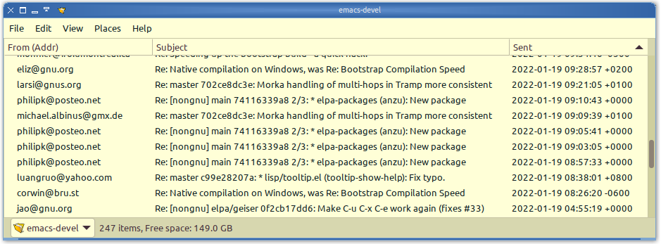

# Nautilus-Maildir / Caja-Maildir / Nemo-Maildir

A simple plugin for Caja/Nemo/Nautilus that adds email metadata as columns to your file-manager. This makes maildir folders more friendly-to-browse.

## Installation
To make the version of the script appropriate for your file-manager, you can just replace 'Caja'/'caja' in Maildir.py with 'Nemo'/'nemo', etc. This is thanks to the scripting interfaces between Caja, Nemo, and Nautilus being more-or-less identical. Alternatively…

`$ make caja; make nemo; make nautilus`

Then you can copy the resultant script into `~/.local/share/[caja|nemo|nautilus]-python/extensions/` or `/usr/share/[caja|nemo|nautilus]-python/extensions/`. Or…

`$ make install-caja; make install-nemo; make install-nautilus`

## Meta
Author is jadedctrl, and the license is the GNU GPLv3+ (in COPYING.txt).

https://notabug.org/jadedctrl/nautilus-maildir  
https://github.com/jadedctrl/nautilus-maildir
